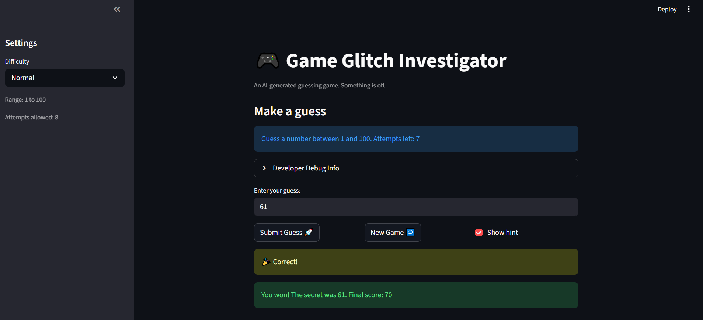
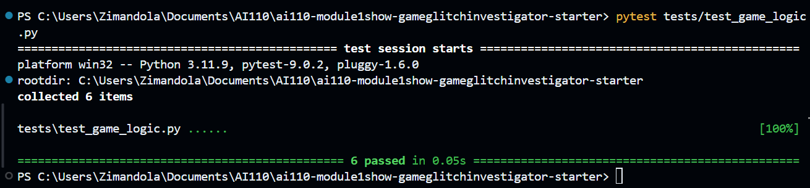

# 🎮 Game Glitch Investigator: The Impossible Guesser

## 🚨 The Situation

You asked an AI to build a simple "Number Guessing Game" using Streamlit.
It wrote the code, ran away, and now the game is unplayable. 

- You can't win.
- The hints lie to you.
- The secret number seems to have commitment issues.

## 🛠️ Setup

1. Install dependencies: `pip install -r requirements.txt`
2. Run the broken app: `python -m streamlit run app.py`

## 🕵️‍♂️ Your Mission

1. **Play the game.** Open the "Developer Debug Info" tab in the app to see the secret number. Try to win.
2. **Find the State Bug.** Why does the secret number change every time you click "Submit"? Ask ChatGPT: *"How do I keep a variable from resetting in Streamlit when I click a button?"*
3. **Fix the Logic.** The hints ("Higher/Lower") are wrong. Fix them.
4. **Refactor & Test.** - Move the logic into `logic_utils.py`.
   - Run `pytest` in your terminal.
   - Keep fixing until all tests pass!

## 📝 Document Your Experience

- The purpose of the game is to allow the user to enter of series of guesses to try and find the hidden target. The user's score is higher if the number of attempts they have taken is low lower vice-versa. The user can also select a difficulty level, which changes the range of the target number. The game provides hints to the user after each guess, indicating whether the guess is too high or too low compared to the target number. The game ends when the user correctly guesses the target number, at which point their final score is displayed.
- The bugs found:
   1. The hints are backwards, it recommends you to go higher when the geuess is too high, and lower when the guess is too low
   2. The enter button doesn't work, it doesn't register the guess and doesn't give any feedback to the user
   3. The range of target number is always displayed as 1-100, even when a different difficulty level is selected. It is always static and doesn't update based on the difficulty level chosen by the user.
- To fix the bugs:
   1. I fixed the hints by changing the logic in the code to provide the correct feedback based on whether the guess is too high or too low compared to the target number.
   2. I fixed the enter button by ensuring that it correctly registers the user's guess and provides feedback on whether the guess is correct, too high, or too low.
   3. I fixed the range display issue by updating the code to dynamically change the displayed range of the target number based on the difficulty level selected by the user.

## 📸 Demo

## Test Resutls

